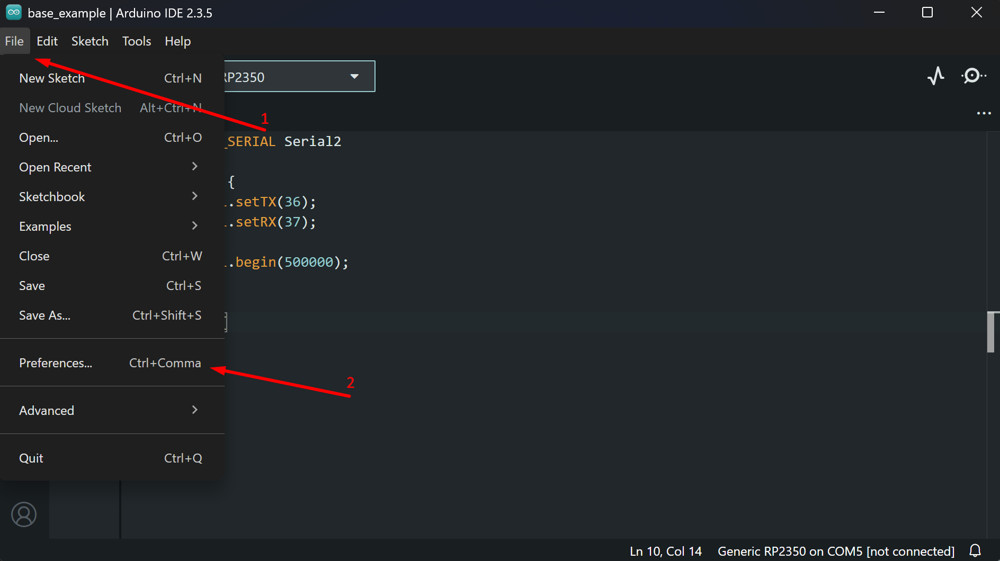
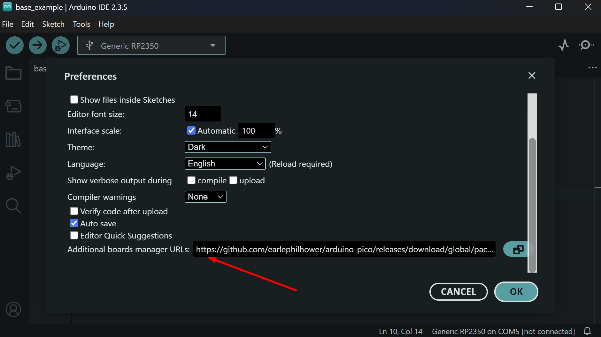
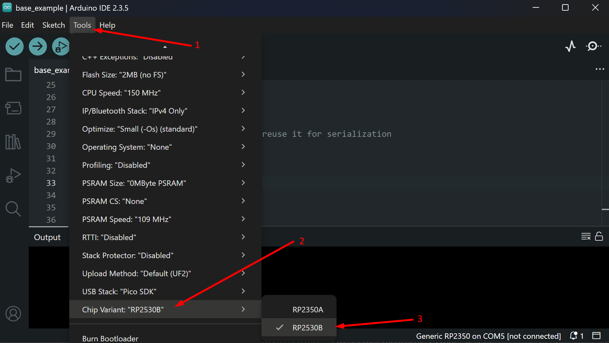

# Getting Started: RP2350 (Arduino IDE)

## Setting Up the Board

To work with RP2350 in Arduino IDE, you need to add board support to your Board Manager:

1\. Open Arduino IDE and go to **File → Preferences**
??? info "Screenshot"
    

2\. Add the following URL to the **Additional Boards Manager URLs** field:
```
    https://github.com/earlephilhower/arduino-pico/releases/download/global/package_rp2040_index.json
```
??? info "Screenshot"
    

3\. Change the target chip variant in **Tools → Chip Variant → RP2350B**
??? info "Screenshot"
    

## Flashing

To flash your code to the RP2350, use the dedicated USB port on top of the device.

!!! warning "Check the power"
    The RP2350 MCU is not powered by the USB port used for flashing. Connect the Power USB to flash the RP2350.

## Serial Communication with Radxa CM3

The RP2350 is connected to Radxa CM3 via UART1 on GPIO 36 (TX) and GPIO 37 (RX) at 500000 baud. You can change the baud rate by updating it in both the RP2350 code and on the CM3 side.

To use UART1 on RP2350, use the `Serial2` object in Arduino IDE and configure the appropriate TX/RX GPIOs and baud rate.

!!! tip "Use JSON for communication"
    The target app on CM3 works well with JSON format, so using JSON for communication means you won't need to implement custom parsers.

Here is the base code for communicating with Radxa CM3:
```arduino title="base_example.ino"
#include <ArduinoJson.h>

// UART1 on RP2350 for CM3 communication (Serial2 object)
#define SPEX_SERIAL Serial2
// USB serial for debug output
#define DEBUG_SERIAL Serial

void setup() {
  DEBUG_SERIAL.begin(115200);
  delay(1000);

  SPEX_SERIAL.setTX(36);
  SPEX_SERIAL.setRX(37);
  SPEX_SERIAL.begin(500000);
}

void loop() {
  // Check for incoming data from CM3
  if (SPEX_SERIAL.available()) {
    String incoming = SPEX_SERIAL.readStringUntil('\n');

    static JsonDocument doc;
    DeserializationError err = deserializeJson(doc, incoming);
    if (!err) {
      int ping = doc["pingValue"];
      ping++;

      // Reuse JsonDocument for response
      doc.clear();
      doc["pingResponse"] = ping;
      serializeJson(doc, SPEX_SERIAL);
    }
  }
}
```